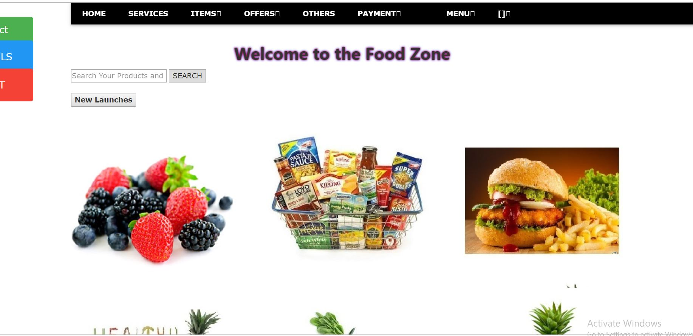

# Food-Zone
Food Zone is a free open source restaurant ordering and management system. Food Zone provides a professional and reliable platform for restaurants wanting to offer online ordering to their customers.

# Features
User

1) User Products viewing.
2) User Login / Registration.
3) User can order and choose quantity.
4) User can view oncart orders.
5) User can remove oncart orders.
6) User can checkout order and serve as pending in admin side.
7) User can track thier order status.
8) User can cancel order

# Admin

1) Admin can monitor users activity.
2) Admin can add,update,delete products.
3) Admin can update product as able and unable. unable meaning it will not be available for ordering.
4) Admin view orders and update order status.
5) Admin can view total sales.
6) Admin can view messages.
7) Admin can message users through their email

# Languages and Frameworks used
1) HTML
2) CSS3
3) JAVASCRIPT
4) JQUERY
5) BOOTSTRAP
6) PHP
7) MYSQL

# How to Setup
Download Xampp or Wamp local server.
Start Xampp or Wamp local server.

 

# Output

